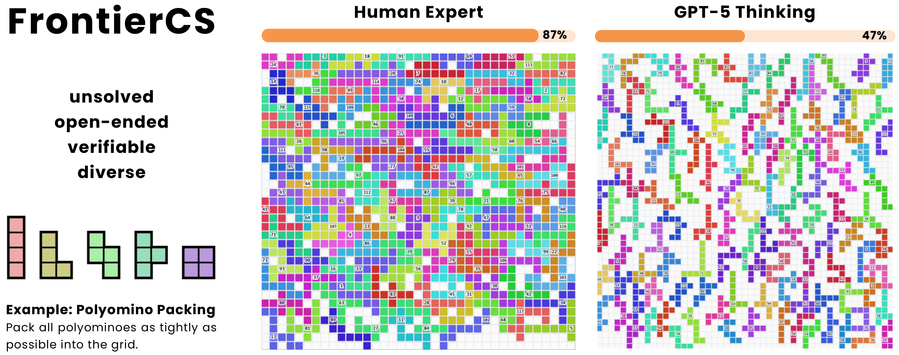

<p align="">
  <a href="https://frontier-cs.org">
    
  </a>
</p>

<h2 align="center">
[ICML'26] FrontierCS: Evolving Challenges for Evolving Intelligence
</h2>

<p align="center">
  <a href="https://frontier-cs.org"></a>
  <a href="https://discord.gg/k4hd2nU4UE"></a>
  <a href="https://deepwiki.com/FrontierCS/Frontier-CS"></a>
  <br>
  <a href="https://arxiv.org/abs/2512.15699"></a>
  <a href="https://huggingface.co/datasets/FrontierCS/Frontier-CS" target="_blank">
    
  </a>
  
  
  
</p>

## News
- **Jun 25, 2026:** FrontierCS was selected as one of 13 projects for [Slingshots // THREE](https://www.laude.org/updates/slingshots-three).
- **Jun 23, 2026:** Frontier-CS is featured in the [Seed 2.1 Model Card](https://lf3-static.bytednsdoc.com/obj/eden-cn/lapzild-tss/ljhwZthlaukjlkulzlp/seed2.1/Seed2_1_Model_Card.pdf) for frontier research evaluation.
- **Jun 11, 2026:** [Roadmap to FrontierCS 2.0](https://frontier-cs.org/blog/frontiercs-2-roadmap/): agent-native algorithmic tasks, released private tests, controlled feedback infrastructure, and 10 repo-level preview tasks.
- **May 27, 2026:** Frontier-CS 2.0 is underway: agent-horizon friendly, verifiable, and harborized from the start.
- **May 26, 2026:** The formerly private algorithmic test cases are now public, making full local, batch, and agent-based evaluation possible without internal repository access.
- **May 12, 2026:** We now provide a Harbor adapter for the Frontier-CS Algorithmic track. See our [Harbor blog post](https://frontier-cs.org/blog/harbor/).
- **Apr 30, 2026:** Frontier-CS was accepted to ICML 2026.

## What is Frontier-CS?

**Frontier-CS** is an _unsolved_, _open-ended_, _verifiable_, and _diverse_ benchmark for evaluating AI on challenging computer science problems.

Think of it as an "exam" for AI, but instead of easy textbook questions, we give problems that are genuinely difficult: ones that researchers struggle with, that have no known optimal solutions, or that require deep expertise to even attempt.

## Why Frontier-CS?

Current benchmarks are becoming too easy. Models score 90%+ on many existing coding benchmarks, but that doesn't mean they can actually do useful research or solve real-world engineering challenges.

**Frontier-CS is different:**

|            | Traditional Benchmarks                     | Frontier-CS                                             |
| ---------- | ------------------------------------------ | ------------------------------------------------------- |
| Difficulty | Often saturated with evolving intelligence | _Unsolved_: no solution has achieved perfect scores     |
| Problems   | Textbook-style, known solutions            | _Open-ended_ research & optimization challenges         |
| Evaluation | Binary pass-or-fail                        | _Verifiable_ continuous scoring, always room to improve |
| Scope      | Usually one domain                         | _Diverse_: systems, ML, algorithms, security, and more  |

## Getting Started

### Installation

**Requirements:** Python 3.11+, Docker 24+ (for local evaluation)

```bash
git clone https://github.com/FrontierCS/Frontier-CS.git
cd Frontier-CS

# Install dependencies (using uv, recommended)
uv sync

# Or with pip:
pip install -e .
```

### Try it yourself

Here's [Algorithmic Problem 0](algorithmic/problems/0/statement.txt) - try to beat GPT-5!

```bash
# Run the example solution (Human Expert Solution)
frontier eval algorithmic 0 algorithmic/problems/0/examples/reference.cpp

# Run the example solution (GPT-5 Thinking Solution)
frontier eval algorithmic 0 algorithmic/problems/0/examples/gpt5.cpp

# Try your own solution!
frontier eval algorithmic 0 <your_solution.cpp>
```

<p align="center">
  
</p>

### Harbor Agent Evaluation

Frontier-CS tasks can also be evaluated through Harbor. The Harbor adapters in
`adapters/` generate Harbor-native task datasets, so users can run their own
agents with Harbor's standard CLI/API instead of calling Frontier-CS directly.
Agents may call the task-local `submit.sh` during a trial for iterative
feedback; the final verifier records the higher of the final solution score
and the best successful iterative submission. If an agent times out after
making submissions, the reward is still available in the trial's
`result.json` and `verifier/reward.json` artifacts.

```bash
# Configure the agent credentials first
export OPENAI_API_KEY=<your-openai-api-key>

# Run Algorithmic Problem 0 through Frontier-CS's Harbor wrapper
uv run frontier harbor trial algorithmic 0 -a codex -m gpt-5.5

# Add --json for reward, tokens, cost, timeout status, and submission metadata
uv run frontier harbor trial algorithmic 0 -a codex -m gpt-5.5 --json
```

Example JSON output:

```json
{
  "reward": 0.7161613642285716,
  "score": 71.61613642285715,
  "score_unbounded": 71.61613642285715,
  "trial_status": "AgentTimeoutError",
  "error_message": "Agent execution timed out after 180.0 seconds",
  "trial_name": "frontier-cs-algorithm-0__example",
  "task_name": "frontier-cs/frontier-cs-algorithm-0",
  "trial_dir": ".frontier-cs/harbor/trials/frontier-cs-algorithm-0__example",
  "agent": "codex",
  "agent_version": "0.134.0",
  "model": "gpt-5.5",
  "n_input_tokens": 359718,
  "n_cache_tokens": 302080,
  "n_output_tokens": 7887,
  "cost_usd": 0.67584,
  "successful_submissions": 2
}
```

The wrapper stores generated Harbor tasks and trial outputs under
`.frontier-cs/harbor/` by default and auto-generates a missing task from the
local repository. It uses an existing `harbor` CLI on `PATH` when available;
otherwise it falls back to `uvx harbor`, keeping Harbor's Python dependencies
isolated from Frontier-CS's own `uv sync` environment.

### Frontier-CS 2.0 Problems

Frontier-CS 2.0 is agent-first: current 2.0 problems are meant to be run
through Harbor-compatible agents rather than direct one-shot solution files.
Problem IDs are their problem directory names, such as `erdos_unit_distance`,
the small `erdos_demo`, the visual `erdos_visual_100`, and BBOPlace variants
such as `bboplace_ispd2005` and `bboplace_direct_ispd2005`.

```bash
# List 2.0 problems
frontier list 2.0

# Run a 2.0 task with an agent through the Harbor wrapper
uv run frontier harbor trial 2.0 erdos_unit_distance -a codex -m gpt-5.5 --json

# Run the small N=10 demo task
uv run frontier harbor trial 2.0 erdos_demo -a codex -m gpt-5.5 --json

# Run the N=100 visual Erdos task
uv run frontier harbor trial 2.0 erdos_visual_100 -a codex -m gpt-5.5 --json

# Run a BBOPlace placement task
uv run frontier harbor trial 2.0 bboplace_ispd2005 -a codex -m gpt-5.5 --json

# Run a direct JSON BBOPlace single-design task
uv run frontier harbor trial 2.0 bboplace_direct_ispd2005 -a codex -m gpt-5.5 --json
```

See [2.0/README.md](2.0/README.md) for the current 2.0 track.

### Research Problems

```bash
# List all problems
frontier list research

# Evaluate (uses SkyPilot by default, requires `sky check`)
frontier eval research flash_attn <your_solution.py>

# Use Docker instead (no cloud setup needed)
frontier eval research flash_attn <your_solution.py> --backend docker
```

See [research/README.md](research/README.md) for full documentation.

### Algorithmic Problems

```bash
# Evaluate (uses Docker by default)
frontier eval algorithmic 1 <your_solution.cpp>

# Use SkyPilot instead
frontier eval algorithmic 1 <your_solution.cpp> --backend skypilot
```

See [algorithmic/README.md](algorithmic/README.md) for full documentation.

### Raw Score

Frontier-CS supports unbounded scoring, enabling open-ended evaluation compatible with algorithm evolution frameworks such as OpenEvolve.

```bash
# Get unbounded score (without clipping to 100)
frontier eval research flash_attn <your_solution.py> --unbounded
frontier eval algorithmic 1 <your_solution.cpp> --unbounded
```

### Python API

```python
from frontier_cs import SingleEvaluator

evaluator = SingleEvaluator()

# Evaluate a research problem
result = evaluator.evaluate("research", problem_id="flash_attn", code=my_code)
print(f"Score: {result.score}")

# Evaluate an algorithmic problem
result = evaluator.evaluate("algorithmic", problem_id=1, code=cpp_code)
print(f"Score: {result.score}")

# Evaluate a Frontier-CS 2.0 problem by name
result = evaluator.evaluate("2.0", problem_id="erdos_unit_distance", code=py_code)
print(f"Score: {result.score}")

# Get unbounded score for algorithmic problems
result = evaluator.evaluate("algorithmic", problem_id=1, code=cpp_code, unbounded=True)
print(f"Score (bounded): {result.score}")
print(f"Score (unbounded): {result.score_unbounded}")
```

See `ARCHITECTURE.md` for an overview of the evaluation stack
and runner mapping.

### Batch Evaluation

For testing your solutions at scale with the released public test cases.

**Solution directory structure:**
```
{track}/solutions/
  {problem}/
    {model}.py          # variant 0
    {model}_1.py        # variant 1
    {model}_2.py        # variant 2
```

Example for research track:
```
research/solutions/
  flash_attn/
    gpt5.py
    claude4.5sonnet.py
  cross_entropy/
    gpt5.py
```

**Basic usage:**

```bash
# Evaluate all research solutions (uses SkyPilot by default)
frontier batch research

# Evaluate all algorithmic solutions (uses Docker by default)
frontier batch algorithmic

# Filter by model or problem
frontier batch research --model gpt5.1
frontier batch research --problem flash_attn

# Override default backend
frontier batch research --backend docker
frontier batch algorithmic --backend skypilot
```

**Custom solutions directory:** You can test solutions from a custom directory with the same structure:

```bash
frontier batch research --solutions-dir ./my_solutions
```

Results are saved to `./results/batch/{track}/` by default. The state file tracks which (solution, problem) pairs have been evaluated, so you can:
- Resume interrupted evaluations automatically
- Run multiple times with different `--solutions-dir` and results accumulate

See `--help` for all options.

> **Note:** For maintainers, `./scripts/run_eval.sh` runs full evaluation using the released public problem data in this repository.


## Evaluating and Submitting Results

Reference solutions are withheld, while the algorithmic test cases are now released for local and batch evaluation. For the complete evaluation workflow (preparing solutions, running batch evaluation, viewing results, and submitting to the leaderboard), see [SUBMIT.md](SUBMIT.md) and submit your solutions to qmang@berkeley.edu, wenhao.chai@princeton.edu, huanzhimao@berkeley.edu, or zhifei.li@berkeley.edu.

Questions? Join our [Discord](https://discord.gg/k4hd2nU4UE)

## Acknowledgments

Some problems are adapted from [ALE-bench](https://github.com/SakanaAI/ALE-Bench) and [AI-Driven Research for Systems (ADRS)](https://ucbskyadrs.github.io/).

## Star History

<a href="https://www.star-history.com/?repos=FrontierCS%2FFrontier-CS&type=date&legend=top-left">
 <picture>
   <source media="(prefers-color-scheme: dark)" srcset="https://api.star-history.com/chart?repos=FrontierCS/Frontier-CS&type=date&theme=dark&legend=top-left" />
   <source media="(prefers-color-scheme: light)" srcset="https://api.star-history.com/chart?repos=FrontierCS/Frontier-CS&type=date&legend=top-left" />
   
 </picture>
</a>

## Citing Us

If you use Frontier-CS in your research, please cite:

```bibtex
@inproceedings{mang2026frontiercs,
  title     = {{FrontierCS}: Evolving Challenges for Evolving Intelligence},
  author    = {Mang, Qiuyang and Chai, Wenhao and Li, Zhifei and Mao, Huanzhi and Zhou, Shang and Du, Alexander and Li, Hanchen and Liu, Shu and Chen, Edwin and Wang, Yichuan and Chu, Xieting and Cheng, Zerui and Xu, Yuan and Xia, Tian and Wang, Zirui and Shi, Tianneng and Yao, Jianzhu and Zhao, Yilong and Zhang, Qizheng and Ruan, Charlie F. and Shen, Zeyu and Liu, Kaiyuan and Hong, Zhaoyang and Gu, Alex and Zhang, Ziyi and He, Runyuan and Xing, Dong and Li, Zerui and Zeng, Zirong and Jiang, Yige and Cheng, Lufeng and Zhao, Ziyi and Sun, Youran and Zhong, Suyang and Wang, Junpeng and Li, Donglin and Huang, Wenyuan and Gu, Jialiang and Zheng, Wesley Kai and Zhang, Wangmeiyu and Ji, Ruyi and Tu, Xuechang and Zheng, Zihan and Wang, Zhaozi and Chen, Zexing and Chen, Jingbang and Zhang, Jialu and Korolova, Aleksandra and Henderson, Peter and Viswanath, Pramod and Ganesh, Vijay and Xie, Saining and Liu, Zhuang and Song, Dawn and Min, Sewon and Stoica, Ion and Gonzalez, Joseph E. and Shang, Jingbo and Cheung, Alvin},
  booktitle = {Proceedings of the International Conference on Machine Learning},
  year      = {2026},
  note      = {To appear}
}
```
